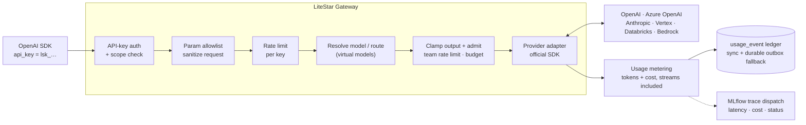
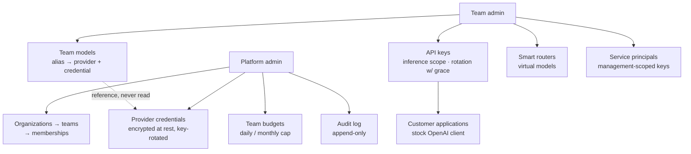

# LiteStar Gateway

[](https://github.com/carlo99999/LiteStarGateway/actions/workflows/ci.yml)
[](LICENSE)
[](pyproject.toml)

**A self-hostable, OpenAI-compatible LLM gateway with a full admin console.**
One clean, direct path from your application to any provider — plus the
multi-tenant management plane to run it: organizations, teams, users, budgets,
smart routing, and usage accounting, all manageable from the browser.

Built on a few deliberate principles:

- **Focused over sprawling** — a curated set of providers, done right, instead
  of a long tail of half-supported ones.
- **Official SDKs** — every provider is called through its own maintained
  client, not reverse-engineered wire formats.
- **Security-first** — encrypted credentials, scoped API keys, rate limiting,
  budgets enforced pre-call, and a clean multi-tenant model, by design rather
  than as an afterthought.
- **Auditable** — a small, hexagonal codebase a team can read in an afternoon,
  with an append-only audit trail for every privileged action.

## Quick start

```bash
docker pull ghcr.io/carlo99999/litestargateway:latest
docker run -p 8000:8000 \
  -e ENVIRONMENT=production \
  -e DATABASE_URL=postgresql+asyncpg://… \
  -e ADMIN_EMAIL=you@example.com \
  -e MASTER_KEY=… -e JWT_SECRET=… -e SALT_KEY=… \
  ghcr.io/carlo99999/litestargateway:latest
```

Then:

- **Admin console** → `http://localhost:8000/ui` (sign in with
  `ADMIN_EMAIL` + `MASTER_KEY`)
- **Interactive API reference** → `/` (Swagger; Scalar at `/scalar`, schema at
  `/openapi.json`)
- **Documentation** → `/docs`

Point any OpenAI client at the gateway with a team API key:

```python
from openai import OpenAI
client = OpenAI(api_key="lsk_...", base_url="https://<host>/v1")
client.chat.completions.create(model="<team-model-alias>", messages=[...])
```

The alias resolves to a team `Model`, which selects the provider and a
platform-managed, encrypted `Credential`. Providers: **OpenAI, Azure OpenAI,
Anthropic, Vertex/Gemini, AWS Bedrock, Databricks**.

For a local prod-like stack (app + Postgres + Redis, with optional external MLflow):
`MASTER_KEY=… JWT_SECRET=… SALT_KEY=… POSTGRES_PASSWORD=… docker compose up --build`.
For full-stack development with live reload: `just dev` (see the
[operations guide](docs/operations.md)).

## How it works

Every inference call goes through the same pipeline — authentication, request
sanitizing, routing and spend control happen **before** the provider is reached.
Successful usage is settled to the authoritative ledger before the response
completes; trace export is dispatched off the hot path:



Around that data plane sits a multi-tenant management plane — who can
configure what:



Teams never see provider secrets: models *reference* a credential, the gateway
decrypts it per call, and usage is attributed back to the team and key for
billing.

## Endpoints

| Endpoint | OpenAI | Azure | Databricks | Anthropic | Vertex | Bedrock |
|---|:--:|:--:|:--:|:--:|:--:|:--:|
| `POST /v1/chat/completions` (+ `stream`) | ✅ | ✅ | ✅ | ✅ | ✅ | ✅ |
| `POST /v1/responses` (+ `stream`) | native | native | emulated | emulated | emulated | emulated |
| `POST /v1/embeddings` | ✅ | ✅ | ✅ | 501 | ✅ | ✅ |
| `POST /v1/images/generations` | ✅ | ✅ | 501 | 501 | ✅ | ✅ |

`GET /v1/models` lists a team's callable models (its enabled models + routers)
in the OpenAI shape, so stock clients can discover what to pass as `model`.

Structured outputs (`response_format` / `text.format`) work on OpenAI, Azure,
Databricks, Anthropic and Vertex, streaming included. Bedrock currently supports
best-effort `json_object`; schema-enforced output stays fail-closed until its
model-specific structured-output matrix is represented explicitly. Native
Anthropic (`/v1/messages`) and Gemini passthrough endpoints are available too — see the
[docs](docs/openai-compatible.md) and the copy-paste
[examples](EXAMPLES.md).

Non-streaming function-tool loops work through Chat Completions on OpenAI,
Azure, Databricks, Anthropic, validated Vertex Gemini 2.5/3 text models, and
capability-gated Bedrock Claude 3/Nova models. Vertex preserves Gemini
thought signatures through Google's documented
`tool_calls[].extra_content.google.thought_signature` carrier.
When Vertex omits a call ID, the gateway adds one and marks it with
`tool_calls[].extra_content.litestar_gateway.synthetic_call_id` so replay can
omit only gateway-generated IDs without guessing from their text.
They also work through native Responses on OpenAI/Azure and emulated Responses
on Databricks/Anthropic/Bedrock. Generic Vertex Responses tool loops and
translated streaming tool events remain fail-closed.

## Admin console

Everything is manageable from the browser at **`/ui`** — served by the gateway
itself, same origin, HttpOnly cookie sessions:

| Area | Pages |
|---|---|
| **Overview** | Role-aware dashboard: counts, gateway health, 30-day spend, routing savings, recent audit activity |
| **Gateway** | Models · Smart routing (all strategies + decision observability) · Credentials · API keys (rotation with 1h grace) |
| **Governance** | Organizations · Teams · Users (invite-by-link) · Service principals |
| **Observability** | Usage & cost · Budgets · Audit log |

Non-admin users see only the teams they belong to. Full guide:
[docs/admin-console.md](docs/admin-console.md).

## Smart routing

Define **virtual models**: N candidates with declared profiles (quality tier,
capabilities, costs) and a pluggable strategy that picks the best one per
request — `complexity` (rule-based), `weighted`, `judge`, `webhook`, `hybrid`
(rules + escalation), `embeddings` (semantic routes). Hard capability filters
run first; any strategy failure falls back to `default_model`, never the
request. Shadow mode validates a strategy on live traffic without activating
it, and every router reports its decision distribution and **estimated savings
vs the most expensive capable candidate**.
[Design](docs/next-steps/smart-routing.md) ·
[webhook contract](docs/routing-webhook.md) ·
[embeddings notes](docs/routing-embeddings.md) ·
[weighted](docs/weighted-routing.md)

## Configuration

See `.env.sample`. Key env vars: `DATABASE_URL` (Postgres in production),
`ADMIN_EMAIL` + `MASTER_KEY` (bootstrap admin), `JWT_SECRET` (token signing),
`SALT_KEY` (credential encryption at rest), `ENVIRONMENT` (`production`
enables startup config checks), `REDIS_URL` (shared rate limits + rotation
lock for replicas), `MLFLOW_TRACKING_URI` (tracing), `MAX_BODY_SIZE` (request
body cap, default 10 MB). Details in the [operations guide](docs/operations.md).

```bash
uv run litestar --app litestar_gateway.app:app run   # dev server
uv run pytest                                        # test suite
uv run pre-commit install                            # once per clone
```

## Deployment

The app ships as a container (multi-stage `Dockerfile`, non-root, uvicorn with
`--proxy-headers`), built and pushed to GHCR on each release tag. Production
requires Postgres; the container applies migrations on start (disable with
`MIGRATE_ON_START=false` when running many replicas). Run it behind a TLS
reverse proxy with `FORWARDED_ALLOW_IPS` set. The production image includes the
pre-built admin UI at `/ui`; the default Compose stack runs without reload or a
bundled MLflow server and reserves/limits the app to 1 CPU and 4 GiB of memory.

Everything operational — proxy/TLS checklist, database and pool sizing,
migrations with replicas, MLflow, Redis and scaling, the local dev stack — is
in the **[operations guide](docs/operations.md)**.

## Security

Invite-only signup, per-account login lockout, HttpOnly cookie sessions with
CSRF, envelope-encrypted credentials with scheduled key rotation, scoped API
keys (personal keys are inference-only; management scope requires a service
principal) with optional expiry and grace-window rotation, per-team/per-key
rate limits, pre-call budget enforcement, request allowlisting + a body-size
cap, SSRF-guarded webhooks, static security response headers, and an
append-only audit trail.

The full security model, accepted limits, and hardening history:
[docs/security-hardening.md](docs/security-hardening.md). To report a
vulnerability: [SECURITY.md](SECURITY.md).

## Status & roadmap

**Everything below is shipped** and covered by CI (ruff + pyrefly + pytest with
an 80% coverage gate + pip-audit + a Postgres migration job):

- Production core: container + compose, Alembic migrations, Postgres,
  structured logging, secrets/key rotation, provider timeouts + retries,
  usage accounting + budgets with a durable outbox, MLflow tracing.
- Enterprise identity: OIDC SSO with hot-reloadable, DB-backed console settings
  (legacy env fallback), SCIM 2.0 provisioning, extended RBAC (platform auditor +
  scoped team roles), account recovery.
- Smart routing: six strategies, shadow mode, decision observability with
  estimated savings, JSONL distillation export.
- **Full admin console** at `/ui` — every sidebar entry is a real page.
- Hardening: `GET /v1/models`, configurable request body-size cap, static
  security response headers, and optional API-key expiry (TTL).
- **Agent framework compatibility (Level A)** — an executable conformance
  suite (real `openai` SDK vs the in-process app) covering chat, streaming,
  tools, structured output, embeddings, router aliases and error shapes, plus
  a [framework guide](docs/agent-frameworks.md) with copy-paste config for
  Pydantic AI / LangChain / LlamaIndex / the OpenAI Agents SDK.
- The full test suite runs on Postgres in CI (not just a subset).
- Console: route-based code splitting (each page loads its own chunk) and
  owner emails on the API-keys table; platform admins configure OIDC without a
  restart.

Next up:

- **Agent framework compatibility (Level B)** — the Responses API works
  end to end today when the upstream provider supports it natively (the
  gateway proxies the typed SSE events: `response.output_text.delta`,
  `response.function_call_arguments.delta`, …). Databricks chat emulation also
  supports faithful non-streaming function-tool loops with stable call IDs and
  stateless result replay; Anthropic and capability-gated Bedrock support the
  same contract with native schema/choice/replay mappings. Validated Vertex
  Gemini 2.5/3 text models now support the direct Chat loop with byte-exact
  thought-signature replay, while generic Vertex Responses tools remain 501
  because normalized function-call items have no safe signature carrier. Other
  unsupported fields fail before budget admission or provider dispatch. The
  remaining Level B work is an explicit Vertex Responses state contract and
  streaming tool events
  ([design](docs/next-steps/responses-level-b.md)).
- **Usage analytics** — attach settled stream usage to routing decisions and add
  temporal cost/token/call charts ([design](docs/next-steps/usage-analytics.md)).
- **Platform quality gates** — request correlation, OpenAPI/migration drift
  checks and critical Playwright flows.

The complete, prioritized execution roadmap — including response caching,
cross-provider failover, guardrails, budget alerts, extended endpoints, routing
evolution and billing integrity — lives in [plans/README.md](plans/README.md).

## Contributing

Contributions are welcome — see [CONTRIBUTING.md](CONTRIBUTING.md) for the
development setup, the quality gate, and the DCO sign-off required on every
commit.

## License

Licensed under the [Apache License 2.0](LICENSE).
