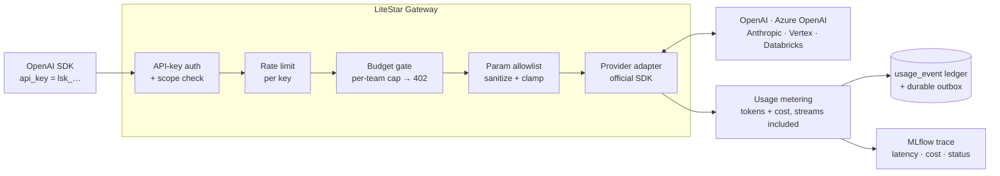
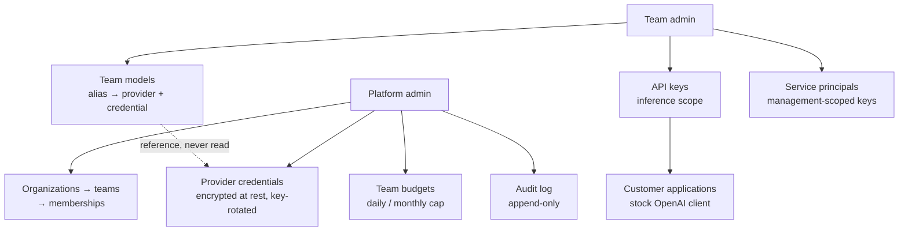

# LiteStar Gateway

[](https://github.com/carlo99999/LiteStarGateway/actions/workflows/ci.yml)
[](LICENSE)
[](pyproject.toml)

**A straightforward, OpenAI-compatible LLM gateway — one clean, direct path from
your application to any provider. Focused, predictable, and free of accumulated
complexity: it does one job and does it well.**

Built on a few deliberate principles:

- **Focused over sprawling** — a curated set of providers, done right, instead of
  a long tail of half-supported ones.
- **Official SDKs** — every provider is called through its own maintained client,
  not reverse-engineered wire formats.
- **Security-first** — encrypted credentials, scoped API keys, rate limiting, and
  a clean multi-tenant model, by design rather than as an afterthought.
- **Auditable** — a small, hexagonal codebase a team can read in an afternoon.

**Status: `v1.0.0`** — the production-ready core is complete (CI, container +
Postgres + migrations, provider resilience, request allowlist, structured
logging, secrets/key rotation, usage accounting, and MLflow observability). See
the [Roadmap](#roadmap) for what's next.

An OpenAI-compatible LLM gateway (Litestar, hexagonal architecture). Customers
point the stock OpenAI client at this server with a team API key:

```python
from openai import OpenAI
client = OpenAI(api_key="lsk_...", base_url="https://<host>/")
client.chat.completions.create(model="<team-model-alias>", messages=[...])
```

The alias resolves to a team `Model`, which selects the provider and a
platform-managed, encrypted `Credential`. Providers: OpenAI, Azure OpenAI,
Databricks, Anthropic, Vertex/Gemini.

## How it works

Every inference call goes through the same pipeline — authentication, spend
control, and request sanitizing happen **before** the provider is reached;
metering and tracing happen right after, off the hot path:



Around that data plane sits a multi-tenant management plane — who can
configure what:



Teams never see provider secrets: models *reference* a credential, the
gateway decrypts it per call, and usage is attributed back to the team and
key for billing.

## Endpoints

| Endpoint | OpenAI | Azure | Databricks | Anthropic | Vertex |
|---|:--:|:--:|:--:|:--:|:--:|
| `POST /v1/chat/completions` (+ `stream`) | ✅ | ✅ | ✅ | ✅ | ✅ |
| `POST /v1/responses` (+ `stream`) | native | native | emulated | emulated | emulated |
| `POST /v1/embeddings` | ✅ | ✅ | ✅ | 501 | ✅ |
| `POST /v1/images/generations` | ✅ | ✅ | 501 | 501 | ✅ |

Plus: users/invites, JWT login (with per-account login lockout), organizations →
teams → memberships, team-scoped API keys, service principals with
management-scoped keys, encrypted provider credentials (admin-managed),
per-key/per-model usage accounting (`GET /teams/{id}/usage`), and per-team
budgets enforced before every call.

## Configuration

See `.env.sample`. Key env vars: `DATABASE_URL`, `MASTER_KEY` (bootstrap admin),
`JWT_SECRET` (login token signing), `SALT_KEY` (credential encryption at rest),
and `ENVIRONMENT` (`development` default; `production` enables startup config
checks — a missing/default `JWT_SECRET` then aborts startup).

```bash
uv run litestar --app litestar_gateway.app:app run
uv run pytest
```

Install the git hooks once per clone (lint, format, and secret scanning run on
every commit; CI runs the same hooks on every PR):

```bash
uv run pre-commit install
```

## Deployment

The app ships as a container (multi-stage `Dockerfile`, non-root, served by
uvicorn with `--proxy-headers`). Provide the secrets via the environment.

```bash
# Local prod-like run (app + Postgres) via compose:
MASTER_KEY=… JWT_SECRET=… SALT_KEY=… POSTGRES_PASSWORD=… docker compose up --build
# → http://localhost:8000  (GET /health liveness, GET /health/ready readiness)
```

Or build and run the image directly:

```bash
docker build -t litestar-gateway .
docker run -p 8000:8000 \
  -e ENVIRONMENT=production \
  -e MASTER_KEY=… -e JWT_SECRET=… -e SALT_KEY=… \
  litestar-gateway
```

Notes:

- **Behind a reverse proxy / TLS**: the app expects to sit behind one. Set
  `FORWARDED_ALLOW_IPS` to your proxy's IP/CIDR so the real client IP reaches
  the per-IP rate limit. The image default is loopback: forwarded headers from
  any other peer are ignored, so a direct client cannot forge its IP to bypass
  the auth rate limit or spoof the audit log.
  When TLS terminates at the proxy (the app sees plain HTTP), also set
  `SESSION_COOKIE_SECURE=true` so the SSO state cookie is still marked `Secure`
  (it defaults on outside local envs), and set `OIDC_REDIRECT_URI` to the public
  callback URL so the IdP redirect matches what's registered.
- **Database**: production requires Postgres. `docker-compose.yml` runs it
  (`postgresql+asyncpg://…`) and the app connects to it. Pool sizing is
  configurable via `DB_POOL_SIZE` / `DB_MAX_OVERFLOW` (Postgres only). The image
  ships no `DATABASE_URL` default: it must point at Postgres or the app refuses
  to start (a SQLite default would give every replica its own database).
- **Migrations**: production uses Alembic (`create_all` is dev/test only). The
  container applies pending migrations on start (`litestar … database upgrade`,
  idempotent). After changing the ORM models, generate a migration in dev with
  `uv run litestar --app litestar_gateway.app:app database make-migrations`, review
  it, and commit it. **With many replicas**, set `MIGRATE_ON_START=false` on the
  app containers and run the upgrade as a dedicated one-shot job / init
  container instead, so N replicas don't race the same upgrade:
  `docker run --rm <image> litestar --app litestar_gateway.app:app database upgrade --no-prompt`.
- **Observability**: set `MLFLOW_TRACKING_URI` to enable request tracing (classic
  MLflow or `databricks`). The compose stack runs a classic MLflow server (UI at
  `http://localhost:5000`) and points the app at it; unset the URI to disable.
- **Multi-process/replicas**: set `REDIS_URL` to back the rate-limit store with a
  shared Redis so limits hold across workers/replicas (the compose stack includes
  a `redis` service and sets it; drop the var to fall back to the in-memory
  per-process store). `REDIS_URL` also enables a distributed lock so only one
  replica runs the daily key rotation (without it, rotation assumes a single
  instance). The trace queue is still per-process (each drains its own).

## Roadmap

**v1.0.0 is released** — everything under "v1 (shipped)" below is done. The
**Enterprise** and **v2** phases are next; items with a design doc have it parked
on their own branch (linked). Order within a phase is a recommendation.

### v1 (shipped) ✅

1. ✅ **CI (GitHub Actions)** _(shipped)_ — runs `ruff` + `pyrefly` + `pytest` on
   every push to `main` and every PR ([`.github/workflows/ci.yml`](.github/workflows/ci.yml),
   [design](docs/ci.md)).
2. ✅ **Container image & deployment** _(shipped)_ — multi-stage [`Dockerfile`](Dockerfile)
   (non-root, uvicorn + `--proxy-headers`, healthcheck) + [`docker-compose.yml`](docker-compose.yml),
   see [Deployment](#deployment) and the [design](docs/deployment.md). _Postgres
   service is stubbed pending the Postgres item._
3. ✅ **Database migrations (Alembic)** _(shipped)_ — production manages the schema
   via Alembic (in `migrations/`); `create_all` is used only in dev/test. The
   container runs `database upgrade` on start ([design](docs/db-migrations.md)).
   _An "autogenerate diff is empty" CI guard is a further step._
4. ✅ **Production Postgres** _(shipped)_ — `asyncpg` driver + configurable
   connection pool (Postgres only); the compose stack runs on Postgres and the
   unit-of-work / bootstrap flow is validated against it
   ([design](docs/postgres.md)). _Running the full test suite on Postgres in CI is
   a further step._
5. 🟡 **Provider resilience** _(timeouts + retries shipped)_ — provider SDK clients
   now use a bounded per-call timeout + retry budget (`REQUEST_TIMEOUT` /
   `MAX_RETRIES`), so a slow/failing upstream fails fast instead of hanging (~10 min
   default). _A per-provider circuit breaker is deferred until the complex routing
   endpoints land (where isolating providers under load matters more)_
   ([design](docs/provider-resilience.md)).
6. ✅ **Request parameter allowlist** _(shipped)_ — deny-by-default sanitizing of
   client params before the provider SDKs
   ([`request_policy.py`](src/litestar_gateway/domain/request_policy.py),
   [design](docs/param-allowlist.md)).
7. ✅ **Structured logging** _(shipped)_ — an environment-aware logging factory:
   human-readable console logs in development, structured **JSON** (structlog) in
   production; exceptions logged server-side, no stack traces leaked to clients
   ([`logging.py`](src/litestar_gateway/infrastructure/logging.py),
   [design](docs/logging.md)). _Request-id correlation is a further step._
8. ✅ **Secrets management & key rotation** _(shipped)_ — envelope encryption: the
   env keys are fixed **masters** (`SALT_KEY` wraps credential keys, `JWT_SECRET`
   wraps JWT signing keys) that wrap a rotating keyring stored in the DB. A daily
   lifespan task (`KEY_ROTATION_ENABLED` / `KEY_ROTATION_TIME`) rotates both —
   re-encrypting credentials to a fresh data key and adding a new JWT key while
   keeping recent ones for the token window ([design](docs/secrets-rotation.md)).
9. ✅ **Observability via MLflow** _(shipped)_ — a `TraceSink` port + MLflow adapter
   (classic **or** Databricks, via `MLFLOW_TRACKING_URI`) records a per-call trace
   (latency, model, tokens, cost, status) to a general experiment. Off the hot
   path: a bounded queue + background worker (`mlflow-skinny` client; traces via
   an explicit `experiment_id`, no global state). Unset URI ⇒ disabled. The compose
   stack includes a classic MLflow server ([design](docs/observability.md)).
   Error and streaming traces are recorded too. _Per-team experiments +
   payload opt-in are follow-ups._
10. ✅ **Usage accounting & budgets** _(shipped)_ — every model call (streams
    included — metered chunk by chunk, with estimation when the provider
    reports no usage) records input/output tokens + cost, tagged with the API
    key and model. `GET /teams/{id}/usage` returns per-model totals, filterable
    by `?model=` and `?api_key_id=`. Per-team budgets (daily/monthly window)
    are enforced **before** every call — over-limit ⇒ `402` — with a durable
    outbox so billing survives transient DB failures
    ([design](docs/usage-cost.md)).
11. ✅ **Account recovery** _(shipped)_ — admin-issued password reset: a platform
    admin creates a single-use, expiring token (`POST /password-resets`, like an
    invite) that the user redeems to set their **own** new password
    (`POST /reset-password`), revoking existing sessions. The admin never sees the
    password; the redeem endpoint is rate-limited and non-revealing
    ([design](docs/account-recovery.md)).

### Enterprise (post-v1)

- 🟡 **SSO (OIDC)** _(shipped)_ — an `IdentityProvider` port + generic OIDC adapter
  (Authlib; works with Google/Microsoft/Okta/Keycloak via their discovery URL).
  `GET /sso/login` → IdP → `GET /sso/callback` JIT-provisions the user (bound to
  the IdP `sub`, verified email required) and mints our JWT; an IdP admin group
  maps to platform admin and is re-synced on every login. Registered only when
  `OIDC_DISCOVERY_URL` is set. Design ported from LiteLLM's OIDC SSO (MIT), no
  code copied. _Follow-ups: group→team mapping, SCIM, SAML, audit,
  per-org SSO, fine-grained RBAC._
  [design](docs/enterprise-sso.md)

### v2 (after v1)

- **AWS Bedrock provider** — Converse API + boto3 (no hand-rolled SigV4), responses emulated.
  [`adding-bedrock`](https://github.com/carlo99999/LiteStarGateway/blob/adding-bedrock/docs/bedrock.md)
- **Weighted multi-model routing** — an alias splitting traffic across ≤5 models by percentage.
  [`adding-weighted-routing`](https://github.com/carlo99999/LiteStarGateway/blob/adding-weighted-routing/docs/weighted-routing.md)
- **Smart (judge-based) routing** — four difficulty tiers + a swappable judge adapter.
  [`adding-smart-routing`](https://github.com/carlo99999/LiteStarGateway/blob/adding-smart-routing/docs/smart-routing.md)
- **Web UI** — SPA over the JSON API for login + admin + usage dashboards.
  [`adding-web-ui`](https://github.com/carlo99999/LiteStarGateway/blob/adding-web-ui/docs/web-ui.md)
- ✅ **LICENSE & repo hygiene** _(shipped)_ — Apache 2.0 [`LICENSE`](LICENSE),
  [`CONTRIBUTING.md`](CONTRIBUTING.md) (DCO sign-off), and a
  [`SECURITY.md`](SECURITY.md) policy (private vulnerability reporting).
- **Test coverage gate** — enforce 80% (`--cov-fail-under`) in CI _(no branch yet)_.
- **Minor hardening** — `GET /v1/models`, request body-size limits, security headers, DB backups, dependency scanning (pip-audit / Dependabot), admin audit log, API-key expiry _(no branch yet)_.

## Security — known issues & follow-ups

Tracked items not yet implemented (see also the code review notes):

- **Cross-team credential usage (by design)** — credentials are platform-global,
  so any team admin can reference any credential in a model and consume it (they
  cannot read its secret). This is intentional for now; tie credentials to a
  team/org if per-team isolation becomes a requirement.
- **SQLite is the dev/test default** — the zero-config default is file SQLite
  (single-writer, weak concurrency); the test suite runs on it. Production
  **requires** the Postgres backend (`postgresql+asyncpg://…`, the compose
  default) — the app fails fast at startup on SQLite there. Running the test
  suite itself on Postgres in CI is still a follow-up.
- **No branch protection / CI merge gate (single maintainer)** — `main` is not
  protected and there is no required CI check on merge. This is an accepted limit
  while the project has a single contributor: every change is still developed on a
  branch, opened as a PR, and merged only after the local gate (`pytest`, `pyrefly`,
  `pre-commit`) is green. Before adding other contributors, enable branch
  protection on `main` requiring PR review + a green CI run.

### Resolved

- **Durable billing** — a failed usage-ledger write no longer just logs-and-drops:
  the event is dead-lettered to a `pending_usage_event` outbox and a background
  reconciler (every 60s) retries it into `usage_event` (idempotent by event id).
  The synchronous ledger write on success is unchanged, so `/usage` stays
  immediately consistent. _Caveat: the outbox is in the same Postgres, so a total
  DB outage still can't be survived — it recovers transient/contention failures
  and provides at-least-once capture; failed dead-letter writes fall back to an
  ERROR log with the full event._
- **Audit log** — privileged actions are recorded to an append-only `audit_event`
  table (who / what / target / from where / when) and read via `GET /audit`
  (platform-admin, paginated, newest first). Written synchronously and durably
  off the inference hot path. Covered so far: credential create/delete, API-key
  create/revoke, team member add/remove/role change, user enable/disable.
  _Follow-ups: login/SSO events, team/org creation, and recording failed
  (permission-denied) attempts._
- **Unvalidated request passthrough** — the client's OpenAI-shaped body is now
  sanitized against a per-operation allowlist before it reaches the provider SDK
  (`domain/request_policy.py`), so SDK-special kwargs (`extra_headers`,
  `extra_body`, `extra_query`, `timeout`, …) are dropped and cost drivers (`n`,
  `max_tokens`) are clamped. Trusted `model.params` are merged separately.
- **Credential exfiltration via model `api_base` (SSRF)** — the provider endpoint
  now comes only from the admin-managed credential, never from the team-controlled
  model (`Model.api_base` was removed). A team admin can no longer redirect a
  credential's secret to an arbitrary host.
- **Missing `api_key` → 500** — a credential without `api_key` now returns a clean
  `400` (`CredentialMisconfigured`) instead of an unhandled error.
- **Invite single-use race (TOCTOU)** — invites are consumed with an atomic
  conditional `UPDATE … WHERE used_at IS NULL`, so concurrent signups can't reuse
  one invite.
- **`last_used_at` write on every request** — the API-key auth hot path now
  persists `last_used_at` at most once per minute per key.
- **No token revocation / logout** — `POST /logout` bumps the user's
  `token_version` (embedded in the JWT), invalidating all previously issued tokens.
- **Email enumeration on signup** — a duplicate email now returns the same
  generic `400` as other client errors (the email is never echoed), so the
  response no longer reveals whether an address is registered. Because signup is
  invite-gated and the invite is consumed *before* the email check, probing an
  address costs one single-use, admin-issued invite per attempt — so enumeration
  is bounded by invite scarcity, not just by the (now generic) response.
- **Rate limiting** — `/v1/*` is throttled **per API key** (hashed, never the
  plaintext; falls back to per-IP for anonymous/invalid tokens) to bound provider
  spend, and `/login` + `/signup` are throttled **per IP** to bound brute force
  and account spam. Limits are conservative constants in
  `infrastructure/web/rate_limit.py`; back the store with Redis for multi-process
  deploys, and set the real client IP upstream (e.g. `--proxy-headers`) behind a
  proxy, since `X-Forwarded-For` is not trusted by default.
- **Non-atomic multi-write operations** — the multi-step flows now run as a unit
  of work: their repositories only stage (`flush`) and the service commits once,
  so the operation persists fully or not at all. `register` consumes the invite +
  creates the user atomically; `create_team` creates the team and both admin
  memberships in a single transaction (the platform admin is the team's first
  admin, plus the named lead). Single-write repositories still commit per call.
- **`JWT_SECRET` dev default** — with `ENVIRONMENT=production` (or `prod`) the app
  fails fast at startup if `JWT_SECRET` is unset or left at the insecure dev
  default, so a misconfigured production deploy can't sign tokens with a known
  key. Outside production the dev default is still allowed for convenience.

## Contributing

Contributions are welcome — see [CONTRIBUTING.md](CONTRIBUTING.md) for the
development setup, the quality gate, and the DCO sign-off required on every
commit.

## License

Licensed under the [Apache License 2.0](LICENSE).
